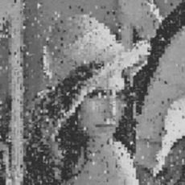

Achievements
============
This project is one of the few available freely and open source,
dealing with the concept of fractal compression for images.

&raquo; Currently implemented
-----------------------------
* different kinds of image segmentation
* different kinds of comparators
  supporting many metrics (AE, MAE, MSE, RMSE)
* many transformations to choose from,
  such as: flip, flop, shear, rotate,
  scale and special optimized transforms.
* a really compact fast and efficient fractal model
* a proof of concept application, as a usage example of the library.

&raquo; Todo
-------------
* Quadtree based and HV partitioning.
* Normalization of images can yield better results for the presented image quality.
* Histogram based image grouping to minimize image comparisons, thus faster compression.
* Multithreading support for even faster compression.

---

Application Workflow
====================
The applications' workflow, is quiet simple.
The application expects configuration arguments such as the tile size,
the initial scale factors, enabling of debug information and others,
to set its internal state and a command along with a file as input.
There are two commands: compress and decompress.
In case of compress, the expected file should be an image.
In case of decompress, the expected file should be a compressed file
as resulted by the compression step.

_Compression_:

Once the application initializes its state,
it reads the image and starts the compressor.
The compressor splits the image into tiles (segmentation step)
and proceeds to compare each tile with every other part of the image
after transforming the image with a set of selected transforms.
The blocks that match most, are kept linked along with the transformation
that has been applied.
The end result is a list of tiles which are linked to a list of transforms,
each of whom is linked with a list of points in the original image, that,
applied to the tile that's linked to them, the result represents that part
of the original image.

_Decompression_:

Decompression works the same way.
The application reads a compressed file,
as generated by the compression step,
and forms back the original image.

Typical timings for compression is about 3min and less than a second for decompression.

---

Results
=======
Input image (top, colored) and results (bottom)
for tiles of `8px`, `4px` and `2px` respectively
  

  
  
  

